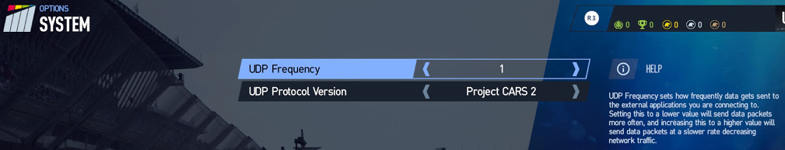

# Project Cars 2 Dashboard


Show Project Cars 2 (PCars2) racing simulation game telemetry on an 8x8
RGB LED display.

The program runs on a Raspberry Pi with a Pimoroni Unicorn hat (8x8 RGB LED
board). Plug the Unicorn board into the Raspberry Pi board. No soldering
needed. This is running on a Raspberry Pi 2 but any Pi from 2-4 should work. It
should also work on a Pi Zero. The code has been tested on PCars2 running on a
Playstation 4 but should work with Xbox One and PC since they all support the
UDP telemetry API. PCars1 and PCars3 are not supported.

The PCars2 API is documented [here](https://www.projectcarsgame.com/two/project-cars-2-api/).

This program is based on the Patch 5 version. Be sure to look at the
Shared Memory version even though it only works on the Windows version
of the game. The Shared Memory header file has many more comments than
the UDP version.

The Unicorn LED hat is [here](https://shop.pimoroni.com/products/unicorn-hat).

Pimoroni gear is sold in the US by Adafruit and probably others.

The Unicorn hat Python library is [here](https://github.com/pimoroni/unicorn-hat).

The UDP telemetry option must be enabled in the game. Set the System Options
UDP Frequency = 1 and UDP Protocol Version = 2.



Like all the Unicorn examples, this program must be run as root!

```
sudo python3 pcars2show.py
```
